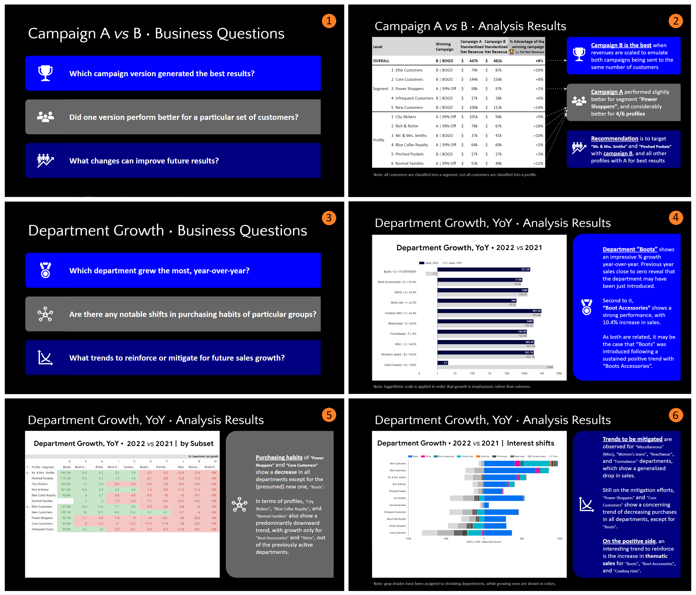

<!-- -------------------------------------------------------------------------------------------------------------------------------------->
<!-- Metadata badges -->

   

<!-- -------------------------------------------------------------------------------------------------------------------------------------->
<!-- Intro -->
#  Growth marketing analysis
🧐 __*A/B Testing & GROWTH Analysis • 2023*__
&nbsp;&nbsp;</img>
&nbsp;&nbsp;</img>  

This repository presents the **analysis of an A/B test**, and visually summarizes **departmental growth trends** for sales data of a hypothetical **retail store**. For A/B testing, revenues are compared following different marketing campaign versions sent to **a base of 110,000 customers**. For departmental growth analysis, **8,234 sales transactions** from two subsequent years are summarized using different **data visualization** approaches to (i) display the **department ranking** in terms of growth, year-over-year (YoY), (ii) **reveal large-scale shifts in purchasing habits** of subsets of customers, and (iii) **unveil overall trends across departments**, to be mitigated and to be boosted, **for future sales growth**.  

The detailed analysis of the A/B testing is presented below, as well as the final visualizations answering to business questions on departmental growth. The SQL code used in analyzing departmental growth are available in the repository directory, and the one used in the A/B analysis (v.2.5.1) is available [here](https://github.com/isis-santos-costa/growth-marketing/blob/51b0ab7d7a5aef18f99a279130488e04b6bc50f7/campaign_a_vs_b.sql) and on [BigQuery](https://console.cloud.google.com/bigquery?sq=223570122894:545353684b9a417e91434b62d2a23de2).  

Tags: `growth`, `analytics`, `ab-testing`  

___

<!-- -------------------------------------------------------------------------------------------------------------------------------------->
<!-- Body -->
# Executive Summary

___

<!---------------------------------------------------------------------------------------------------------------------------------------->
<!-- Contents -->

## Contents  

[Step 1 • Business question](#step-1--business-question)  
[Step 2 • Data collection](#step-2--data-collection)  
[Step 3 • Data cleaning](#step-3--data-cleaning)  
[Step 4 • Analysis](#step-4--analysis)  
[Step 5 • Synthesis](#step-5--synthesis)  

___

<!---------------------------------------------------------------------------------------------------------------------------------------->
<!-- Resources -->

## Resources  

[Spreadsheet • Google Sheets](https://docs.google.com/spreadsheets/d/1H8AvUnwQO8APc5vr6cfUISoxNP9Sx38o/edit?usp=sharing&ouid=106534574815446903983&rtpof=true&sd=true)  
[SQL Code • (on BigQuery)](https://console.cloud.google.com/bigquery?sq=223570122894:545353684b9a417e91434b62d2a23de2)  
[SQL Code • (Github file)](https://github.com/isis-santos-costa/growth-marketing/blob/51b0ab7d7a5aef18f99a279130488e04b6bc50f7/campaign_a_vs_b.sql)  

___

<!---------------------------------------------------------------------------------------------------------------------------------------->
<!-- Query structure -->

## Query structure  

[Parameter &nbsp; |&nbsp; % Tolerance to split unbalance in A/B testing]()  
[Function 1 &nbsp;|&nbsp; Standardizing factor for subsets with unbalanced split in the A/B test]()  
[Function 2 &nbsp;|&nbsp; Standardized values]()  
[Function 3 &nbsp;|&nbsp; Winning Campaign, considering Standardization]()  
[Function 4 &nbsp;|&nbsp; Standardized % advantage of the Winning Campaign]()  
[CTE &nbsp;&nbsp;1 &nbsp;|&nbsp; Campaign results | Overall]()  
[CTE &nbsp;&nbsp;2 &nbsp;|&nbsp; Campaign results | by Customer Segment]()  
[CTE &nbsp;&nbsp;3 &nbsp;|&nbsp; Campaign results | by Customer Profile]()  
[CTE &nbsp;&nbsp;4 &nbsp;|&nbsp; Campaign results | Overall & by Customer Segment & by Customer Profile | Long Table]()  
[CTE &nbsp;&nbsp;5 &nbsp;|&nbsp; Campaign results | Winning as per Net Revenue | showing also by other criteria | Wide Table]()  
[CTE &nbsp;&nbsp;6 &nbsp;|&nbsp; Campaign results | Winning as per STANDARDIZED Net Revenue | showing also other criteria | Wide Table]()  
[CTE &nbsp;&nbsp;7 &nbsp;|&nbsp; Campaign results | Winning as per STANDARDIZED Net Revenue | with OVERALL total of STD values]()  
[CTE &nbsp;&nbsp;8 &nbsp;|&nbsp; Campaign results | Winning as per STANDARDIZED Net Revenue | with OVERALL total and % of STD values]()  
[Unit tests / Final query]()  

___

<!---------------------------------------------------------------------------------------------------------------------------------------->
<!-- Step 1 -->

## Step 1 • Business question  

The search in the A/B testing is for insight into the following question and its unfoldings:

> <i> « Overall, which version generated better incremental results? » </i>  
>> <i> « Did a particular version perform better for a particular set of customers? » </i>  
>> <i> « What changes can be made to this marketing campaign in order to improve future results? » </i>  

For departmental growth, the analysis aims at answering:

> <i> « Overall, which Department grew the most from year to year? » </i>  
> <i> « Are there any particular groups of customers that are showing notable shifts in their purchasing habits from year to year? » </i>  
> <i> « Based on this data, what marketing efforts or strategies will reinforce positive trends or mitigate negative trends to grow future sales? » </i>  

[↑](#contents)

___

